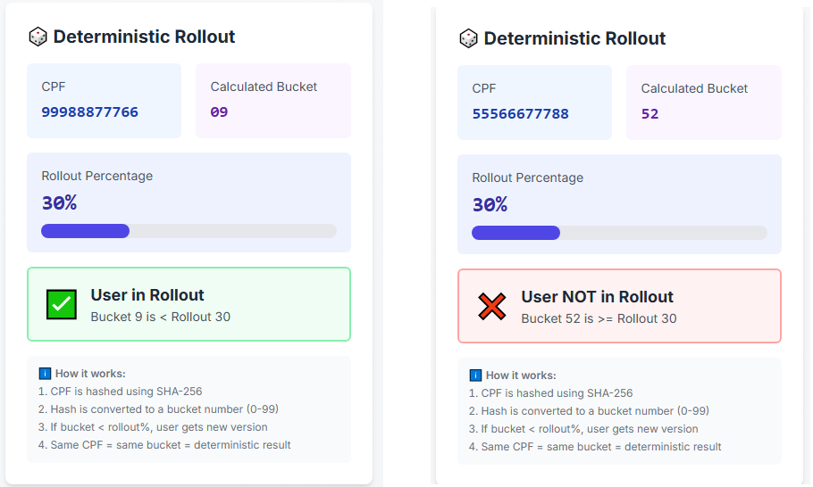
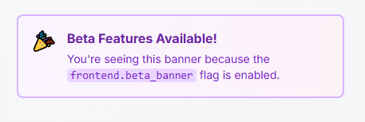

# 🏴 Vexilla Complete Demo

A **complete, production-ready demonstration** of feature flags using **Vexilla**, showcasing real-world scenarios with a fully functional e-commerce checkout system.


## 🎯 What You'll Learn

This demo showcases:

- ✅ **Deterministic Rollout** - Same user always gets the same experience (no flickering)
- ✅ **Kill Switches** - Instant rollback without deployment
- ✅ **Rate Limiting** - Middleware controlled by flags
- ✅ **Admin Operations** - Cache invalidation and metrics
- ✅ **Visual Feedback** - See exactly how flags work in real-time

---

## 📋 Table of Contents

- [Quick Start](#-quick-start-5-minutes)
- [Architecture](#-architecture)
- [Feature Flags](#-feature-flags)
- [Visual Demo Guide](#-visual-demo-guide)
- [API Documentation](#-api-documentation)
- [Frontend Features](#-frontend-features)
- [Production Guide](#-production-considerations)
- [Troubleshooting](#-troubleshooting)

---

## 🚀 Quick Start (5 Minutes)

### Prerequisites

- **Go 1.21+** - [Download](https://go.dev/dl/)
- **Node.js 18+** - [Download](https://nodejs.org/)
- **Docker** - [Download](https://www.docker.com/get-started)

### 1️⃣ Start Flagr (30 seconds)

```bash
docker run -d --name flagr -p 18000:18000 ghcr.io/openflagr/flagr
```

Wait 10 seconds, then verify:

```bash
curl http://localhost:18000/api/v1/health
# Should return: {"status":"OK"}
```

**Flagr UI:** [http://localhost:18000](http://localhost:18000)

### 2️⃣ Setup Flags (30 seconds)

**Option A: Using Bash (Linux/Mac/WSL)**
```bash
cd scripts
chmod +x setup-flags.sh
./setup-flags.sh
```

**Option B: Using Go (Windows/Any OS)**
```bash
# From repository root (vexilla/)
cd examples
go run setup-flags.go
```

You should see: `✅ Flagr setup completed!`

### 3️⃣ Start Backend (30 seconds)

Open a **new terminal**:

```bash
cd backend
go mod download  # First time only
go run main.go
```

You should see:
```
✅ Server ready!
🌐 Listening on http://localhost:8080
```

Verify:
```bash
curl http://localhost:8080/health
```

### 4️⃣ Start Frontend (2 minutes)

Open **another new terminal**:

```bash
cd frontend
npm install  # First time only
npm run dev
```

You should see:
```
Ready on http://localhost:3000
```

### 5️⃣ Open Your Browser

Go to: **http://localhost:3000**

🎉 **You're ready to explore!**

---

## 🏗️ Architecture

```
┌──────────────┐         ┌──────────────┐         ┌──────────────┐
│   Next.js    │────────▶│   Go + Gin   │────────▶│    Flagr     │
│   Frontend   │  HTTP   │   + Vexilla  │  Cache  │   (Flags)    │
└──────────────┘         └──────────────┘         └──────────────┘
```

### Components

1. **Backend (Go + Gin + Vexilla)**
   - REST API with feature flag evaluation
   - Deterministic rollout using CPF hash (SHA-256)
   - Rate limiting middleware (flag-controlled)
   - Admin endpoints for cache management

2. **Frontend (Next.js + TypeScript + Tailwind)**
   - User simulator for testing different contexts
   - Real-time flag status visualization
   - Checkout flow demonstration (V1 vs V2)
   - Admin panel for operations

3. **Flagr (Feature Flag Server)**
   - Feature flag management system
   - Provides flag definitions and rules
   - Admin UI for flag configuration

---

## 🚩 Feature Flags

This demo uses **6 feature flags** to demonstrate different use cases:

### 1. `api.checkout.v2` (Boolean - Kill Switch)

**Purpose:** Enable/disable checkout V2 globally

**When enabled:**
- Allows rollout evaluation to proceed
- Users in rollout bucket can see V2

**When disabled:**
- All users get V1 (safe fallback)
- Instant emergency shutdown capability

**Use case:** Kill switch for immediate rollback if bugs are discovered

---

### 2. `api.checkout.rollout` (Number 0-100)

**Purpose:** Control percentage of users getting V2



**How it works:**
1. User's CPF is hashed with SHA-256
2. Hash is converted to bucket (0-99)
3. If `bucket < rollout`, user gets V2
4. **Same CPF = Same bucket (deterministic)**

**Example:**
- Rollout = 30
- User with bucket 25 → Gets V2 ✅
- User with bucket 55 → Gets V1 ❌

**Benefits:**
- No flickering (same user always sees same version)
- Gradual rollout (10% → 30% → 50% → 100%)
- Instant adjustment (change 30 to 70, invalidate cache)

---

### 3. `api.rate_limit.enabled` (Boolean)

**Purpose:** Enable/disable API rate limiting

**When enabled:**
- Applies rate limit: 10 requests/minute per IP
- Returns HTTP 429 if exceeded

**When disabled:**
- Bypasses rate limiting entirely

**Use case:** Control load on API without code changes

---

### 4. `api.kill_switch` (Boolean)

**Purpose:** Global API shutdown for emergencies

**Use cases:**
- Security incident detected
- Database overload
- Critical bug discovered

**Impact:** Returns HTTP 503 for all requests

---

### 5. `frontend.new_ui` (Boolean)

**Purpose:** Toggle new UI design

**Implementation:**
```tsx
{flags["frontend.new_ui"] ? <NewUI /> : <OldUI />}
```

---

### 6. `frontend.beta_banner` (Boolean)

**Purpose:** Show/hide beta banner



**Implementation:**
```tsx
{flags["frontend.beta_banner"] && <BetaBanner />}
```

---

## 🎬 Visual Demo Guide

Use this guide to present and demonstrate Vexilla in action.

### Pre-Demo Checklist

- [ ] Flagr running on `http://localhost:18000`
- [ ] Backend running on `http://localhost:8080`
- [ ] Frontend running on `http://localhost:3000`
- [ ] Browser open at `http://localhost:3000`

### Demo Part 1: Basic Concepts (5 minutes)

**1. Show the Dashboard**

Open `http://localhost:3000` and point out:

- **Left Column:** User Simulator (switch between users)
- **Center Column:** Flags Status (real-time)
- **Right Column:** Checkout Demo (click to test)

**2. Explain the Concept**

> "We have 6 active flags controlling different aspects:
> - **checkout.v2** - Kill switch (ON/OFF for V2)
> - **checkout.rollout** - Percentage (0-100%)
> - **rate_limit** - Controls API throttling
> - **kill_switch** - Emergency shutdown
> - **new_ui** and **beta_banner** - Frontend toggles"

### Demo Part 2: Deterministic Rollout (10 minutes)

**1. Test with User 1**

- Select "João Silva - 12345678909"
- Observe the Rollout Indicator showing:
  - CPF: 12345678909
  - Calculated Bucket: **XX**
  - Rollout: 30%
- Click "🛒 Test Checkout"

> "João's CPF is hashed and generates bucket **XX**.
> With 30% rollout, he [gets V2 / stays on V1]."

**2. Test with User 2**

- Select "Maria Santos - 98765432100"
- Observe different bucket number
- Click "🛒 Test Checkout"

> "Different CPF = different bucket.
> Maria has bucket **YY**, so she sees [V1 / V2]."

**3. Show Determinism**

- Go back to João Silva
- Click "🛒 Test Checkout" **5 times**

> "See? João ALWAYS gets the same version.
> **This is deterministic rollout.**
> Same CPF = same bucket = same experience.
> **Zero flickering!**"

### Demo Part 3: Increase Rollout (5 minutes)

**1. Access Flagr UI**

- Open new tab: `http://localhost:18000`
- Click "Flags"
- Find: "api.checkout.rollout"
- Click on the flag

> "Now let's simulate increasing rollout.
> We're at 30%, let's go to 70%."

**2. Change Rollout Value**

- Click "Variants"
- Edit the variant (currently "30")
- Change value from `30` to `70`
- Click Save

> "Changed from 30% to 70%.
> But backend still has cache..."

**3. Invalidate Cache**

- Go back to `http://localhost:3000`
- Switch to "Admin User" (user-3)
- In Admin panel, click "Invalidate Rollout"
- Click "Refresh" on flags panel

> "Cache invalidated!
> See: rollout changed from 30% → 70%!"

**4. Test Again**

- Switch between João and Maria
- Test checkout for both

> "Users who were on V1 might now see V2!
> 40% more users now get the new version.
> **Without any deployment!**"

### Demo Part 4: Kill Switch (3 minutes)

**1. Simulate Emergency**

> "Now imagine: we discovered a critical bug in V2.
> Need to turn it off **immediately**!"

**2. Disable V2**

- Go to Flagr UI (`http://localhost:18000`)
- Find flag: "api.checkout.v2"
- Click the toggle to **DISABLE**
- Confirm

> "Disabled the checkout.v2 flag.
> This is the **kill switch**."

**3. Invalidate and Test**

- Back to frontend (stay as admin)
- Click "Invalidate Checkout V2"
- Click "Refresh" on flags
- Test any user

> "**ALL users are back to V1!**
> Instant rollback.
> No deployment.
> No risk.
> **2 seconds total.**"

### Demo Part 5: Visual Differences (2 minutes)

**Compare V1 vs V2**

- **V1 (Blue):** Classic interface, simple design
- **V2 (Green):** Modern interface with exclusive features:
  - One-click checkout
  - Apple Pay / Google Pay
  - Saved payment methods
  - Express shipping

### Admin Panel & Metrics


**Switch to admin user (user-3)** to see:

- **Invalidate All Flags** - Clear entire cache
- **Invalidate Specific Flag** - Clear single flag
- **Metrics:**
  - Cache Hits: 120
  - Cache Miss: 8
  - Flags Loaded: 6
  - Circuit Breaker: closed
  - Last Refresh timestamp

---

## 📡 API Documentation

### Base URL
```
http://localhost:8080
```

### Request Headers

All requests should include:

| Header | Required | Description | Example |
|--------|----------|-------------|---------|
| `X-User-ID` | Yes | User identifier | `user-1` |
| `X-CPF` | Yes | Brazilian CPF (11 digits) | `12345678909` |
| `X-User-Role` | No | User role | `user` or `admin` |
| `X-Country` | No | Country code | `BR` |

### Endpoints

#### `GET /health`

Health check endpoint.

**Response:**
```json
{
  "status": "ok",
  "service": "vexilla-demo-api",
  "time": "2025-01-15T10:30:00Z"
}
```

---

#### `POST /checkout`

Checkout endpoint demonstrating deterministic rollout.

**Headers Required:** `X-User-ID`, `X-CPF`

**Response (V1):**
```json
{
  "version": "v1",
  "message": "Checkout Legacy",
  "details": {
    "cpf": "12345678909",
    "bucket": 42,
    "ui": "classic",
    "color": "#3B82F6"
  },
  "timestamp": "2025-01-15T10:30:00Z"
}
```

**Response (V2):**
```json
{
  "version": "v2",
  "message": "Checkout Modernizado",
  "details": {
    "cpf": "12345678909",
    "bucket": 15,
    "ui": "modern",
    "color": "#10B981"
  },
  "features": [
    "One-click checkout",
    "Apple Pay / Google Pay",
    "Saved payment methods",
    "Express shipping"
  ],
  "timestamp": "2025-01-15T10:30:00Z"
}
```

---

#### `GET /flags/snapshot`

Get current flag values for a user context.

**Headers Required:** `X-User-ID`, `X-CPF` (optional)

**Response:**
```json
{
  "flags": {
    "api.checkout.v2": true,
    "api.checkout.rollout": 30,
    "api.rate_limit.enabled": false,
    "api.kill_switch": false,
    "frontend.new_ui": true,
    "frontend.beta_banner": true
  },
  "context": {
    "user_id": "user-1",
    "cpf": "12345678909",
    "role": "user",
    "country": "BR",
    "bucket": 42
  },
  "timestamp": "2025-01-15T10:30:00Z"
}
```

---

#### `POST /admin/flags/invalidate-all`

Invalidate all flags cache.

**Response:**
```json
{
  "message": "All flags cache invalidated successfully",
  "timestamp": "2025-01-15T10:30:00Z"
}
```

---

#### `POST /admin/flags/:flagKey`

Invalidate specific flag cache.

**Example:** `POST /admin/flags/api.checkout.v2`

**Response:**
```json
{
  "message": "Flag 'api.checkout.v2' invalidated successfully",
  "flag": "api.checkout.v2",
  "timestamp": "2025-01-15T10:30:00Z"
}
```

---

#### `GET /admin/flags/metrics`

Get Vexilla client metrics.

**Response:**
```json
{
  "cache_hits": 120,
  "cache_miss": 8,
  "flags_loaded": 6,
  "circuit_breaker": "closed",
  "last_refresh": "2025-01-15T10:29:45Z",
  "uptime_seconds": 1705314600
}
```

---

## 🎨 Frontend Features

### 1. User Simulator

Switch between different user contexts:

- **5 Mock Users** - Pre-configured with different CPFs
- **Custom User** - Enter your own CPF and attributes
- **Real-time Updates** - Flags re-evaluated on context change

### 2. Flag Status Panel

Visual representation of all flags:

- ✔ **Green** = Enabled
- ✖ **Red** = Disabled
- 🎯 **Percentage** = Rollout value

### 3. Rollout Indicator

Shows the deterministic rollout algorithm in action:

- CPF input
- Calculated bucket (0-99)
- Rollout percentage with progress bar
- Final result (✅ In Rollout / ❌ Not in Rollout)
- Explanation of how it works

### 4. Checkout Demo

Interactive demonstration:

- Click "🛒 Test Checkout"
- See which version you get (V1 or V2)
- Visual differences:
  - V1: Blue theme, classic UI
  - V2: Green theme, modern UI with features list
- Shows bucket calculation and decision

### 5. Admin Panel

Available when `role=admin`:

- **Invalidate All Flags** - Clear entire cache
- **Invalidate Specific Flags** - Clear individual flags
- **View Metrics** - Cache performance statistics
- **Last Refresh Time** - When cache was last updated

---

## 🛠️ Development

### Project Structure

```
99-complete-api/
├── backend/                    # Go API
│   ├── main.go                 # Main application
│   ├── go.mod                  # Go dependencies
│   └── README.md
├── frontend/                   # Next.js Frontend
│   ├── src/
│   │   ├── app/
│   │   │   ├── page.tsx        # Main page
│   │   │   ├── layout.tsx      # Layout
│   │   │   └── globals.css     # Global styles
│   │   ├── components/
│   │   │   ├── UserSimulator.tsx
│   │   │   ├── FlagStatus.tsx
│   │   │   ├── RolloutIndicator.tsx
│   │   │   ├── CheckoutDemo.tsx
│   │   │   └── AdminActions.tsx
│   │   ├── services/
│   │   │   └── api.ts          # API client
│   │   └── types/
│   │       └── index.ts        # TypeScript types
│   ├── package.json
│   └── README.md
├── scripts/
│   └── setup-flags.sh          # Flag setup script
├── docker-compose.yml          # Flagr setup
├── Makefile                    # Useful commands
└── README.md                   # This file
```

### Modify Rollout Percentage

1. Open Flagr UI: [http://localhost:18000](http://localhost:18000)
2. Find flag: `api.checkout.rollout`
3. Edit variant value (0-100)
4. In frontend admin panel, click "Invalidate Rollout"
5. Refresh flags to see change

### Test Kill Switch

1. In Flagr, disable `api.checkout.v2`
2. Invalidate cache in frontend
3. All users now get V1, regardless of bucket

### Using Make Commands

```bash
# Start everything
make dev

# In separate terminals:
make backend
make frontend

# Check health
make health

# Test checkout with different CPFs
make test-checkout

# Stop all services
make stop

# Clean up
make clean
```

---

## 🚀 Production Considerations

### Security

- ✅ Add authentication to admin endpoints
- ✅ Use HTTPS in production
- ✅ Validate CPF format server-side
- ✅ Rate limit admin operations
- ✅ Use environment variables for secrets
- ✅ Never log sensitive user data

### Performance

- ✅ Vexilla caches flags locally (30s default)
- ✅ Minimize Flagr API calls
- ✅ Use circuit breaker for resilience
- ✅ Monitor cache hit ratio
- ✅ Set appropriate cache TTL

### Reliability

- ✅ Always provide fallback values
- ✅ Handle flag evaluation errors gracefully
- ✅ Test kill switch before incidents
- ✅ Document rollback procedures
- ✅ Monitor flag evaluation performance

### Monitoring

Add observability:

```go
// Metrics examples
flagEvaluations.Inc()
cacheHits.Inc()
rolloutDistribution.Observe(bucket)
```

---

## 🧪 Testing Scenarios

### Scenario 1: Gradual Rollout

1. Set rollout to 10%
2. Test multiple CPFs
3. Increase to 30%
4. **Same CPFs should remain stable**
5. Increase to 100%
6. Everyone gets V2

### Scenario 2: Emergency Rollback

1. User reports bug in V2
2. Disable `api.checkout.v2` in Flagr
3. Click "Invalidate Checkout V2"
4. **All users instantly on V1**

### Scenario 3: A/B Testing

1. Set rollout to 50%
2. Test 10 different users
3. ~50% should see each version
4. Measure conversion metrics for each group

### Scenario 4: Dark Launch

1. Set rollout to 0%
2. Feature is in PROD but OFF
3. Create segment in Flagr for `role=admin`
4. Admins test in production
5. Users don't see anything

### Scenario 5: Canary Deployment

1. **Day 1:** 10% → Monitor metrics
2. **Day 2:** 30% → All good, continue
3. **Day 3:** 50% → All good, continue
4. **Day 4:** 100% → Feature complete!

If problems at any step → **Kill switch!**

---

## ❓ Troubleshooting

### Flagr not starting

```bash
# Check if port 18000 is in use
lsof -i :18000  # Mac/Linux
netstat -ano | findstr :18000  # Windows

# Remove old container
docker rm -f flagr

# Start fresh
docker run -d --name flagr -p 18000:18000 ghcr.io/openflagr/flagr
```

### Backend can't connect to Flagr

```bash
# Verify Flagr is running
curl http://localhost:18000/api/v1/health

# Check backend logs
# Should see: "✅ Server ready!"
```

### Frontend can't connect to backend

1. Check backend is running on `:8080`
2. Check CORS configuration in [backend/main.go](backend/main.go)
3. Verify `NEXT_PUBLIC_API_URL` in `.env.local`
4. Check browser console for errors

### Flags not updating

1. Click "Invalidate All Flags" in admin panel
2. Wait for cache refresh (30s)
3. Click "Refresh" button on flags panel
4. Check Flagr UI for correct flag configuration
5. Restart backend if needed

### Build errors

**Backend:**
```bash
cd backend
go mod tidy
go mod download
go run main.go
```

**Frontend:**
```bash
cd frontend
rm -rf node_modules package-lock.json
npm install
npm run dev
```

---

## 🎯 Key Takeaways

This demo showcases:

1. **Deterministic Rollout** - Same user always gets same experience
2. **Kill Switches** - Instant rollback without deployment (2 seconds!)
3. **Middleware Control** - Enable/disable features via flags
4. **Admin Operations** - Cache management for immediate updates
5. **Visual Feedback** - Users understand what's happening

### Impact Phrases

> "Deployment is no longer scary. Just turn on a flag."

> "If something goes wrong, kill switch in 2 seconds. No code rollback."

> "Same user always sees same version. Zero flickering."

> "We can test in production without impacting customers."

> "Feature flags transform deployment from risky event to safe operation."

---

## 📚 Additional Resources

- **Vexilla Client:** [github.com/OrlandoBitencourt/vexilla](https://github.com/OrlandoBitencourt/vexilla)
- **Flagr Server:** [openflagr.github.io/flagr](https://openflagr.github.io/flagr)
- **Gin Framework:** [github.com/gin-gonic/gin](https://github.com/gin-gonic/gin)
- **Next.js:** [nextjs.org](https://nextjs.org/)
- **Architecture Guide:** `vexilla_demo_api_routes_implementation_guide.md`
- **Flag Setup Guide:** `flagr_setup_vexilla_demo_script_de_criacao_de_flags.md`
- **Frontend Guide:** `vexilla_demo_frontend_next.md`

---

## 📝 License

This example is part of the Vexilla project.

---

## 🙏 Acknowledgments

Built with:
- [Vexilla](https://github.com/OrlandoBitencourt/vexilla) - Feature flag client for Go
- [Flagr](https://github.com/openflagr/flagr) - Feature flag management system
- [Gin](https://github.com/gin-gonic/gin) - HTTP web framework for Go
- [Next.js](https://nextjs.org/) - React framework for production
- [Tailwind CSS](https://tailwindcss.com/) - Utility-first CSS framework

---

**Happy Feature Flagging! 🏴**

Feature flags aren't just a technical trick—they're **critical infrastructure** that enables continuous deployment with confidence, testing in production without risk, and instant rollback capabilities.

**With Vexilla, you have total control over your features, without touching code.**
